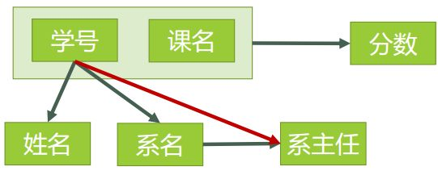
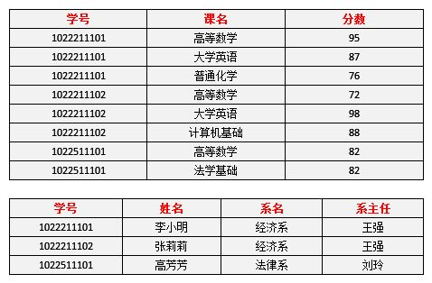
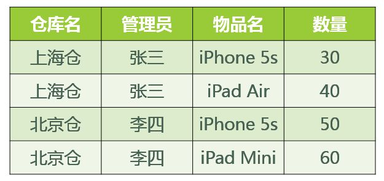

##数据库自学笔记
以下内容均摘自互联网，所以有些内容可能不太准确，仅对这些概念做些了解即可。
https://www.zhihu.com/question/24696366/answer/29189700
http://www.cnblogs.com/CareySon/archive/2012/05/08/2489748.html

数据库需要有良好的设计。这里的良好设计我所指的是数据库的设计符合业务逻辑并至少实现第三范式。

首先要明白“范式（NF）”是什么意思。按照教材中的定义，范式是“符合某一种级别的关系模式的集合，表示一个关系内部各属性之间的联系的合理化程度”。很晦涩吧？实际上你可以把它粗略地理解为一张数据表的表结构所符合的某种设计标准的级别。就像家里装修买建材，最环保的是E0级，其次是E1级，还有E2级等等。数据库范式也分为1NF，2NF，3NF，BCNF，4NF，5NF。一般在我们设计关系型数据库的时候，最多考虑到BCNF就够。符合高一级范式的设计，必定符合低一级范式，例如符合2NF的关系模式，必定符合1NF。

在介绍各种范式之前，先介绍一些术语。

####函数依赖
函数依赖我们可以这么理解（但并不是特别严格的定义）：若在一张表中，在属性（或属性组）X的值确定的情况下，必定能确定属性Y的值，那么就可以说Y函数依赖于X，写作 X → Y。也就是说，在数据表中，不存在任意两条记录，它们在X属性（或属性组）上的值相同，而在Y属性上的值不同。这也就是“函数依赖”名字的由来，类似于函数关系 y = f(x)，在x的值确定的情况下，y的值一定是确定的。
也不一定是前者能直接推导出后者，只要有这种函数的关系就行了。

####完全函数依赖和部分函数依赖
在一张表中，若 X → Y，且对于 X 的任何一个真子集X'（假如属性组 X 包含超过一个属性的话），X' → Y 不成立，那么我们称 Y 对于 X 完全函数依赖，记作 X F→ Y。（那个F应该写在箭头的正上方）
假如 Y 函数依赖于 X，但同时 Y 并不完全函数依赖于 X，那么我们就称 Y 部分函数依赖于 X，记作 X P→ Y

####传递函数依赖
传递函数依赖：设X,Y,Z是关系R中互不相同的属性集合，存在X→Y(Y !→X),Y→Z，则称Z传递函数依赖于X。

例子：在关系R(学号 ,宿舍, 费用)中，(学号)->(宿舍),宿舍！=学号，(宿舍)->(费用),费用!=宿舍，所以符合传递函数的要求；

假如 Z 函数依赖于 Y，且 Y 函数依赖于 X （感谢@百达指出的错误，这里改为：『Y 不包含于 X，且 X 不函数依赖于 Y』这个前提），那么我们就称 Z 传递函数依赖于 X ，记作 X T→ Z，如图3。

这段话中提到的两个前提，实际上是为了保证函数依赖具有“传递”的特点，即必须有一个有意义的中间属性。如果Y包含于X，肯定无法体现传递性了；再如果X函数依赖于Y，那么X和Y是相互函数依赖的，也无法体现传递性。

####码（候选码、候选键）
码是数据系统中的基本概念。所谓码就是能唯一标识实体的属性，他是整个实体集的性质，而不是单个实体的性质。
设 K 为某表中的一个属性或属性组，若除 K 之外的所有属性都完全函数依赖于 K（这个“完全”不要漏了），那么我们称 K 为候选码，简称为码。在实际中我们通常可以理解为：假如当 K 确定的情况下，该表除 K 之外的所有属性的值也就随之确定，且K的任意属性子集都不具有这个性质，那么 K 就是码。一张表中可以有超过一个码。
候选码之间一定不会互相包含，否则与候选码的定义矛盾。
**候选码之间可以有交集吗？**我觉得可以。

####主码（主键）
一张表中可以有超过一个码。实际应用中为了方便，通常选择其中的一个码作为主码。
如果一张表中只有一个（候选）码，那么码和主码是一个意思。

####超码（超键）
超码的概念不是很重要，主要是加深对（候选）码的概念的理解。
设 K 为某表中的一个属性或属性组，若除 K 之外的所有属性都部分函数依赖于 K，那么我们称 K 为超码。

####主属性和非主属性
候选码的诸属性称为主属性
不包含在任何候选码中的属性称为非主属性

###第一范式(1NF)
1NF的定义为：符合1NF的关系中的每个属性都不可再分。下表所示的情况，就不符合1NF的要求。

实际上，1NF是所有关系型数据库的最基本要求。即我们在这些关系型数据库中，无法设计出形似上表的表结构。
如果我们要在RDBMS中表现表中的数据，就得设计为下表的形式:

###一个表实例
我们将对下图给出的例子，一步一步的进行优化，以解释第二范式、第三范式的实际意义。

####该表的主码是什么？
根据关系完整性约束的实体完整性，主码（还是候选码？这个定义还没搞清楚），任何一条记录的主码中的任何一个属性的取值都不能为null，且任意两条记录的主码的取值是不同的。因此，该表的唯一的码、也就是主码为(学号，课名)
#####如何更可靠、更全面的找所有的码？
第一步：
查看所有每一单个属性，当它的值确定了，是否剩下的所有属性值都能确定。
查看所有包含有两个属性的属性组，当它的值确定了，是否剩下的所有属性值都能确定。
……
查看所有包含了六个属性，也就是所有属性的属性组，当它的值确定了，是否剩下的所有属性值都能确定。
我们前面提到码之间不能相互包含，所以如果已经找到了一个码，所有包含它的超集都不必再考虑。

####该表存在什么问题？
- 数据冗余
每一名学生的学号、姓名、系名、系主任这些数据重复多次。每个系与对应的系主任的数据也重复多次
- 插入异常
假如学校新建了一个系，但是暂时还没有招收任何学生（比如3月份就新建了，但要等到8月份才招生），那么是无法将系名与系主任的数据单独地添加到数据表中去的（要添加进去，必须要有具体的学生，因为该表的主码中的属性之一是学号，而且该系所开的课程也可能没有确定，课名也是该表主码中的属性）
- 删除异常
假如将某个系中所有学生相关的记录都删除，那么所有系与系主任的数据也就随之消失了（一个系所有学生都没有了，并不表示这个系就没有了）。
- 更新异常（更新操作所涉及的记录条数过多）
假如李小明转系到法律系，那么为了保证数据库中数据的一致性，需要修改三条记录中系与系主任的数据。（当然课名和分数可能也需要修改）
**更新异常**实际上也是数据冗余的一种表现。

该表很明显是符合第一范式的，正因为仅符合1NF的数据库设计存在着这样那样的问题，我们需要提高设计标准，去掉导致上述四种问题的因素，使其符合更高一级的范式（2NF），这就是所谓的“规范化”。

###第二范式(2NF)
第二范式（2NF）在关系理论中的严格定义我这里就不多介绍了（因为涉及到的铺垫比较多），只需要了解2NF对1NF进行了哪些改进即可。其改进是，2NF在1NF的基础之上，消除了非主属性对于码的部分函数依赖。

为了检查一个表是否存在非主属性对于码的部分函数依赖，我们进行以下步骤：
第一步：找出数据表中所有的码。
第二步：根据第一步所得到的码，找出所有的主属性。
第三步：数据表中，除去所有的主属性，剩下的就都是非主属性了。
第四步：查看是否存在非主属性对码的部分函数依赖。

该表的码只有（学号，课名），所以主属性只有学号、课名，剩下的姓名、系名、系主任、分数都是非主属性。各属性之间的依赖关系如下图所示：

即分数完全函数依赖于码，而姓名、系名、系主任部分函数依赖于码，另外还有系主任完全函数依赖于系名。
正因为姓名、系名、系主任部分函数依赖于码，所以该表不符合2NF。

####通过模式分解消除非主属性对码的部分函数依赖
为了让表3符合2NF的要求，我们必须消除这些部分函数依赖，只有一个办法，就是将大数据表拆分成两个或者更多个更小的数据表，在拆分的过程中，要达到更高一级范式的要求，这个过程叫做”模式分解“。模式分解的方法不是唯一的，以下是其中一种方法：
选课（学号，课名，分数）
学生（学号，姓名，系名，系主任）
为什么想到这么模式分解呢？通过上述分析我们发现，姓名、系名、系主任只需要学号就可以确定，而不需要码中的另外一个属性课名，所以我们将课名及其分数放到一张新的选课表中，为了表示是谁的选课信息，还需要加入学号。

#####选课表
码为（学号，课名），主属性为学号、课名，非主属性为分数，不存在部分函数依赖

#####学生表
码为（学号），主属性为学号，非主属性为姓名、系名、系主任，码为单属性，必然不存在部分函数依赖。

此时表结构已符合2NF的要求。

####该表是否还存在问题(2NF解决了哪些问题)
- 数据冗余
数据重复性已大大降低，但是学生表中系名和系主任的信息还存在冗余。
- 插入异常
假如学校新建了一个系，但是暂时还没有招收任何学生（比如3月份就新建了，但要等到8月份才招生），那么是无法将系名与系主任的数据单独地添加到数据表中去的（要添加进去，必须要有具体的学生，因为该表的主码中的属性之一是学号，而且该系所开的课程也可能没有确定，课名也是该表主码中的属性）
- 删除异常
假如将某个系中所有学生相关的记录都删除，那么所有系与系主任的数据也就随之消失了（一个系所有学生都没有了，并不表示这个系就没有了）。
- 更新异常（更新操作所涉及的记录条数过多）
假如李小明转系到法律系，修改一条记录即可，更新异常有所缓解。

####2NF是如何解决数据冗余问题的？
由此，我们发现，2NF可观的缓解了数据冗余的问题。正是由于非主属性对于码的部分函数依赖，导致了非主属性取值的重复出现，因此有必要将码中没有被部分函数依赖的属性单独拿出来和其相关的非主属性组成一个新的表。
**码中没有被部分函数依赖的属性及其相关属性的变化，导致了多条记录中，部分函数依赖于码的非主属性的取值的冗余。**

####2NF无法解决什么问题？
但是无法解决插入和删除异常的问题。那插入和删除异常的本质是什么？存在非主属性对码的传递函数依赖，这里的传递性决定了我们只有将该非主属性和其直接依赖的属性（即传递性中涉及的中间属性）单独拿出来组成一个新的表，才能解决上述的问题。

###第三范式（3NF）
第三范式（3NF） 3NF在2NF的基础之上，消除了非主属性对于码的传递函数依赖。也就是说，如果存在非主属性对于码的传递函数依赖，则不符合3NF的要求。
接下来我们看看上表中的设计，是否符合3NF的要求。对于选课表，主码为（学号，课名），主属性为学号和课名，非主属性只有一个，为分数，不可能存在传递函数依赖，所以选课表的设计，符合3NF的要求。对于学生表，主码为学号，主属性为学号，非主属性为姓名、系名和系主任。因为 学号 → 系名，同时 系名 → 系主任，所以存在非主属性系主任对于码学号的传递函数依赖，所以学生表的设计，不符合3NF的要求。

为了让数据表设计达到3NF，我们必须进一步进行模式分解为以下形式：
选课（学号，课名，分数）
学生（学号，姓名，系名）
系（系名，系主任）

对于选课表，符合3NF的要求，之前已经分析过了。
对于学生表，码为学号，主属性为学号，非主属性为姓名、系名，不存在非主属性对于码的传递函数依赖，所以符合3NF的要求。
对于系表，码为系名，主属性为系名，非主属性为系主任，不可能存在非主属性对于码的传递函数依赖（至少要有三个属性才可能存在传递函数依赖关系），所以符合3NF的要求。
新的依赖关系如下：

新的表如下：

####3NF解决了哪些问题？
删除某个系中所有的学生记录
该系的信息不会丢失。——有改进
插入一个尚无学生的新系的信息。
因为系表与学生表目前是独立的两张表，所以不影响。——有改进
数据冗余更加少了。——有改进

现在的表结构已经比较合理了

###结论
由此可见，符合3NF要求的数据库设计，基本上解决了数据冗余过大，插入异常，修改异常，删除异常的问题。当然，在实际中，往往为了性能上或者应对扩展的需要，经常做到2NF或者1NF，但是作为数据库设计人员，至少应该知道，3NF的要求是怎样的。

###BCNF范式
要了解 BCNF 范式，那么先看这样一个问题：
若：某公司有若干个仓库；每个仓库只能有一名管理员，一名管理员只能在一个仓库中工作；一个仓库中可以存放多种物品，一种物品也可以存放在不同的仓库中。每种物品在每个仓库中都有对应的数量。
那么关系模式 仓库（仓库名，管理员，物品名，数量） 属于哪一级范式？

####我的分析
仓库和管理员是一一对应的，所以互相完全函数依赖；同一种物品可以出现在多个不同的仓库中，所以物品名不依赖于仓库名。
码为（仓库名，物品名）和（管理员，物品名）
主属性为仓库名、管理员、物品名，非主属性为数量。

首先肯定属于第一范式，其次，非主属性不能被码中的任何一个属性单独确定，所以属于第二范式,也不存在传递函数依赖，因此属于第三范式。

####表实例
基于此关系模式的关系（具体的数据）可能如图所示：

####存在什么问题？
先新增加一个仓库，但尚未存放任何物品，是否可以为该仓库指派管理员？
不可以，因为物品名也是主属性，根据实体完整性的要求，主属性不能为空。
也就是说，如果我要指派管理员，并将其保存到表中，则必须有物品。属于插入异常。

某仓库被清空后，需要删除所有与这个仓库相关的物品存放记录，会带来什么问题？
仓库本身与管理员的信息也被随之删除了。属于删除异常。

如果某仓库更换了管理员，会带来什么问题？
这个仓库有几条物品存放记录，就要修改多少次管理员信息。属于修改异常。

####问题的原因
存在着主属性对于码的部分函数依赖与传递函数依赖。（在此例中就是存在主属性【仓库名】对于码【（管理员，物品名）】的部分函数依赖。
也就是说，码中没有被部分函数依赖的属性及其相关属性的变化，导致了多条记录中，部分函数依赖于码的主属性的取值的冗余。

####如何解决
仓库（仓库名，管理员）
库存（仓库名，物品名，数量）

这样，之前的插入异常，修改异常与删除异常的问题就被解决了。

