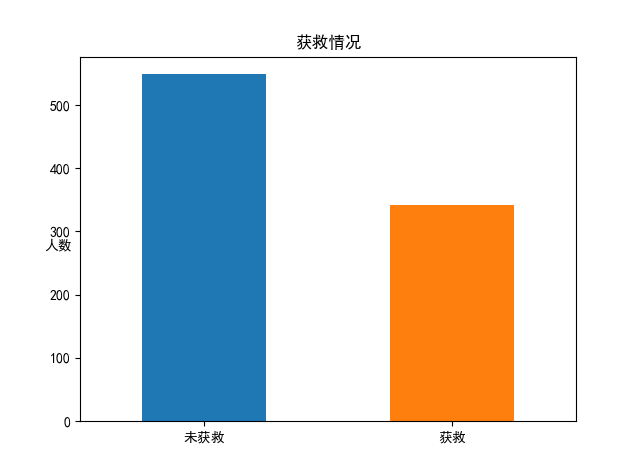
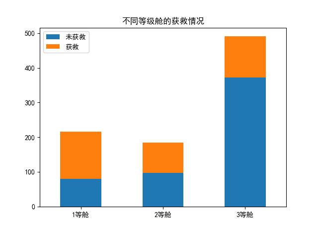
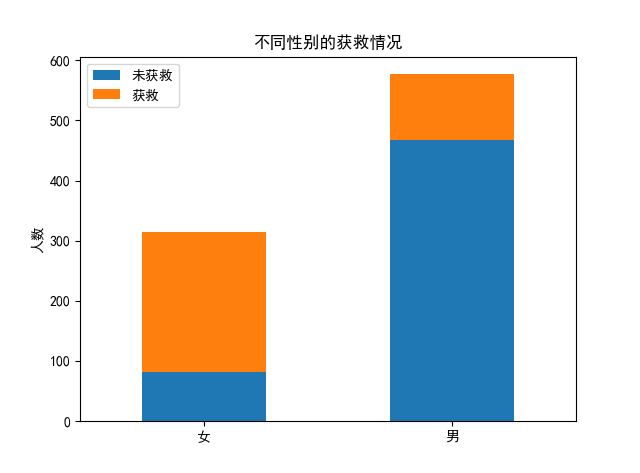
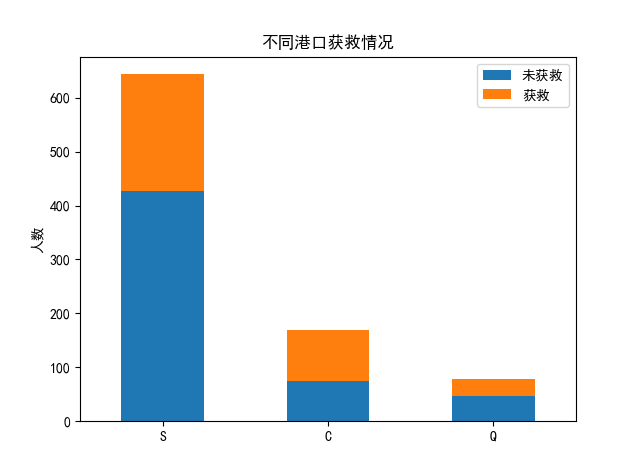

### 认识/了解数据
#### 基本信息
```data_train=pd.read_csv("train.csv")```
读入数据
```print(data_train.info())``` 输出基本信息
```print(data_train.head())```输出前五条记录
共有890条记录，每条记录有12列域
包括
- PassengerId 乘客ID, 从0开始编号，乘客的唯一标识，int
- Survived 是否存活，1为存活，0为未存活, int
- Pclass 船舱的等级，分为1,2,3 三级，其中1等级最高, int
- Name 姓名, obj 
- Sex 性别, obj
- Age 年龄, float
- SibSp 兄弟姐妹的数量, int
- Parch 孩子父母的数量, int
- Ticket 船票编号, obj
- Fare 船票价格, float
- Cabin 房间号, obj
- Embarked 上船的港口,分为C,S,Q, obj
其中Age和Cabin的记录不完整，Age 714名乘客有记录，缺失较少，Cabin 204名乘客有记录，缺失较多。

以上，对数据的结构和内容有了基本的了解

#### 基础统计信息
```print(data_train.describe())```
<pre>
       PassengerId    Survived      Pclass         Age       SibSp  \
count   891.000000  891.000000  891.000000  714.000000  891.000000   
mean    446.000000    0.383838    2.308642   29.699118    0.523008   
std     257.353842    0.486592    0.836071   14.526497    1.102743   
min       1.000000    0.000000    1.000000    0.420000    0.000000   
25%     223.500000    0.000000    2.000000   20.125000    0.000000   
50%     446.000000    0.000000    3.000000   28.000000    0.000000   
75%     668.500000    1.000000    3.000000   38.000000    1.000000   
max     891.000000    1.000000    3.000000   80.000000    8.000000   

            Parch        Fare  
count  891.000000  891.000000  
mean     0.381594   32.204208  
std      0.806057   49.693429  
min      0.000000    0.000000  
25%      0.000000    7.910400  
50%      0.000000   14.454200  
75%      0.000000   31.000000  
max      6.000000  512.329200  
</pre>

可以看到，只有数值类型的域给出了这些统计信息
从中也可以获得一些有用的信息，例如
Survived的平均值就是存活率，约38.4%的乘客存活了下来。
Pclass的平均值为2.31，也就是说大部分的乘客位于3等舱

#### 通过作图获取对数据的直观理解
首先整体上思考一下可以作哪些图，加深对数据的理解
什么叫对数据的理解(insight)呢？对于每一种数据，我们要知道它对存活率是否有影响，如果有影响，是怎么影响的？这些insight可以和后续所建模型的结果进行比对。
- 各船舱的存活人数比例
- 不同兄弟姐妹人数的存活比例（存活人数：未存活人数）
- 不同孩子父母人数的存活比例
- 不同性别的存活比例
- 不同港口的存活比例
年龄、船票价格是连续值
姓名、房间号、船票编号暂时不考虑

另外，PassengerId是后来加上的乘客的编号，与泰坦尼克号事件本身没有关系，所以不属于影响因素；Survived是最终的标签。

##### 存活人数与未存活人数
只需要对data_train.Survived 进行value_count即可
<pre>
data=data_train.Survived.value_counts()
data.plot(kind='bar')
plt.xticks(np.arange(2),(u'未获救',u'获救'),rotation=0)
plt.title(u'获救情况')
plt.ylabel(u'人数',verticalalignment='top',horizontalalignment='left',rotation=0)
</pre>

##### 各船舱存活人数
理想中的图表应为：横坐标是船舱，直方图，每一个直方叠加得画了存活人数和未存活人数
```Survived_0=data_train[data_train.Survived == 0].Pclass.value_counts()```
这样求出的是各个舱中未存活人数的统计值
别人的代码是这么写的也行，但还是我的解释性高一点
```Survived_0=data_train.Pclass[data_train.Survived == 0].value_counts()```

```Survived_0``` 的输出如下
<pre>
Survived_0
Out[71]: 
3    372
2     97
1     80
Name: Pclass, dtype: int64

type(Survived_0)
Out[72]: pandas.core.series.Series
</pre>
可见它是一个Series，标签类型是Pclass（本质也是int），内容是int
同理可求得各个舱中存活人数的统计值
```Survived_1=data_train[data_train.Survived == 1].Pclass.value_counts()```

接下来我们将这两个Series拼成一个DataFrame
下面是方法介绍，其中参数给出的是列表，当然也可以是Series
<pre>
d = {'col1': [1, 2], 'col2': [3, 4]}
df = pd.DataFrame(data=d)
df
   col1  col2
0     1     3
1     2     4
</pre>
可见，每一个列表/Series按照列的形式进行组织
<pre>
df = pd.DataFrame({u'未获救':Survived_0,u'获救':Survived_1})
df
Out[81]: 
   未获救   获救
1   80  136
2   97   87
3  372  119
</pre>
可见，这样得到的DataFrame横坐标是舱等级，纵坐标是获救/未获救人数
接下来还是直接调用DataFrame的plot方法，由于获救人数和未获救人数是同一性质的，所以我们将stacked置为True
总代码如下：
<pre>
Survived_0=data_train[data_train.Survived == 0].Pclass.value_counts()
Survived_1=data_train[data_train.Survived == 1].Pclass.value_counts()
df = pd.DataFrame({u'未获救':Survived_0,u'获救':Survived_1})
df.plot(kind='bar',stacked=True)
plt.title('不同等级舱的获救情况')
plt.xticks(np.arange(3),('1等舱','2等舱','3等舱'),rotation=0)
</pre>
图表如下

观察到，3等舱人最多，但是获救人数比例很少；1、2等舱人数较少，后者比前者较少，但是在获救比例上，前者超过了一半，后者没有超过一半。

##### 不同性别的存活情况
图的形式和不同等级舱的存货情况相同，废话不多说，直接上代码
<pre>
Survived_M=data_train[data_train.Sex == 'male'].Survived.value_counts()
Survived_F=data_train[data_train.Sex == 'female'].Survived.value_counts()
df=pd.DataFrame({'男':Survived_M,'女':Survived_F})
df=df.transpose()
df.columns=['未获救','获救']
df.plot(kind='bar',stacked=True)
plt.xticks(np.arange(2),('女','男'),rotation=0)
plt.title('不同性别的获救情况')
plt.ylabel('人数')
</pre>
我们观察到，虽然图表和上一部分是一样的，但是代码却不带一样，仔细观察一下，这个顺序其实无所谓，因为后面我们可以通过转置来进行调整。
图表如下

可见女性的获救比例比男性高得多
**tips:**
    上面的两个部分中，我们都对DataFrame进行了筛选，筛选的条件可以不是唯一的，可以增加更多的中括号+选择条件的方式进行复合条件选择
##### 各登船港口的获救情况
代码
<pre>
Survived_0=data_train[data_train.Survived == 0].Embarked.value_counts()
Survived_1=data_train[data_train.Survived == 1].Embarked.value_counts()
df=pd.DataFrame({u'未获救':Survived_0,u'获救':Survived_1})
df.plot(kind='bar',stacked=True)
plt.title('不同港口获救情况')
plt.ylabel('人数')
plt.xticks([0,1,2],('S','C','Q'),rotation=0)
</pre>


可见各港口的登船人数差距较大，在获救比例上，C港口较高，S和Q港口较低。
猜测不同的港口对应不同的居住区，不同的居住区的居民的社会地位和经济水平不同。

