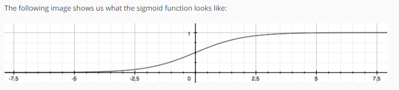
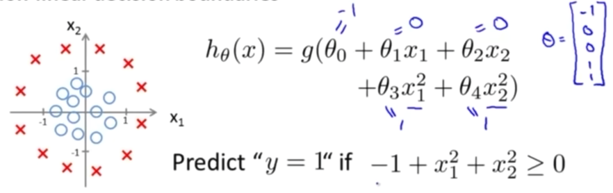

分类问题和回归问题在形式上差不多，都是一些特征作为输入，外加一个输出。区别在于，回归问题中输出是连续的，而分类问题中的输出只是少量的离散值。接下来，我们主要聚焦于二元分类问题，输出取值0和1，输出另外称作**标记（label）** 。

分类1被称作positive class,分类2被称作negative class

解决分类问题可以用我们之间学过的线性回归，例如，输出大于0.5的，分类为1，输出小于0.5的，分类为0。但实际上分类的边界并不是线性的，所以无法用线性回归方法高效地解决。


解决分类问题有一种常用的方法，叫```逻辑回归```

我们首先考虑修改回归问题中的hypothesis，将其限定在0和1之间。


$h_\theta(x)=g(\theta^Tx)$ 

$z=\theta^Tx$

$g(z)=\frac{1}{1+e^{-z}}$ 

这里的$g(z)$ 是```logistic sigmoid function``` 



这个刚好将实数范围限定在了0和1之间

我们可以将$h_\theta(x)$的结果视作分类为1的概率
分类为1的概率+分类为0的概率=1
如果分类为1的概率大于0.5，输出分类为1，否则输出分类为0。根据logistic sigmoid function的曲线，我们很容易发现，当z大于等于0时，概率大于等于0.5，当z小于0时，概率小于0.5。换句话说，当z大于等于0时，输出分类为1，当z小于0时，输出分类为0

这样好像和线性回归的区别就不大了？
看下面的例子

除了外层的sigmoid function，内层实际上就是我们之前讲过的polynomial regression,像图中那样的函数形式，就能构造出一个非线性的分类边界，例如一个圆。

举个例子，垃圾邮件分类为1，普通邮件分为为0，以某一邮件的特征x为输入，输出为y（在0到1之间），那么y就代表当前邮件为垃圾邮件的概率。
即
$h_\theta(x)=P(y=1|x;\theta)$

####decision boundary
就是决定分类的边界，是hypothesis function的一个属性，将多维空间划分为了多个部分，每个部分对应不同的分类。
再强调一下，分类边界是hypothesis function及其参数的属性，而不是训练集的属性。（对于训练集，也确实有一个完美的分类边界，但是我们这里对这个名称的指代做出了规定）训练集是通过调整hypothesis function的参数来间接地影响分类边界。

####Cost Function
We will use cost function to fit parameter theta of hypothesis function to our training set so that we can get a better decision boundary.

$J(\theta)=\frac{1}{m}\sum_{i=1}^mcost(h_\theta(x^{(i)}),y)$
回顾一下线性回归
$cost(h_\theta(x^{(i)}),y)=\frac{1}{2}(h_\theta(x^{(i)})-y)^2$

在逻辑回归中，$h_\theta(x)$比线性回归中的多了一个sigmoid function，因此不能再简单的采用线性回归中的形式。（线性回归中采用这个形式，一个是好理解，一个是这样cost function是凸的，只存在唯一的全局最小值）

如果在逻辑回归中，仍采用这个形式的cost function，则不再是凸函数(non-convex function，即存在若干个局部最小值)，给优化带来困难，因此需要根据分类问题的特点另外设计cost function。

在逻辑回归中，cost function采用log函数的形式，具体公式记不住没关系，纸上推导一下非常快。

$cost(h_\theta(x^{(i)}),y)=\begin{cases}  -log(h_\theta(x)),if \space y=1 \\ -log(1-h_\theta(x)),if \space y=0\end{cases}$
写成一个式子如下：
$cost(h_\theta(x),y)=-ylog(h_\theta(x))-(1-y)log(1-h_\theta(x))$

可以证明，这种形式的cost function是凸函数

这样，完整的cost function如下
$J(\theta)=-\frac{1}{m}\sum_{i=1}^m[y^{(i)}log(h_\theta(x^{(i)}))+(1-y^{(i)})log(1-h_\theta(x^{(i)}))]$
向量形式如下
$J(\theta)=\frac{1}{m}·[-y^Tlog(g(X\theta))-(1-y^T)log(g(X\theta))]$

####Gradient Descent
我们仍采用梯度下降法对hypothesis function的参数进行优化。
复习一下梯度下降法的通式
Repeat{
    $\theta_j:=\theta_j-\alpha \frac{\partial}{\partial\theta_j} J(\theta)$
}
带入逻辑回归的cost function可以得到下述结果
Repeat{
    $\theta_j:=\theta_j-\frac{\alpha}{m}·\sum_{i=1}^m(h_\theta(x^{(i)})-y^{(i)})x_j^{(i)}$
}
这个结果和线性回归中的梯度下降法是一样的
向量形式如下
Repeat{
    $\theta:=\theta-\frac{\alpha}{m}X^T[g(X\theta)-Y]$
}

####高级算法介绍
梯度下降法并不是唯一的方法
还有
- Conjugate gradient（共轭梯度法）
- BFGS（变尺度法）
- L-BFGS（限制变尺度法）

通常情况下，我们不需要了解这些算法的细节，利用别人封装好的就行了。
这些算法会比梯度下降法更加复杂，但是收敛速度比梯度下降法更快，而且learning rate $\alpha$ 也不需要自己来选，算法会自动帮你选。

####Multiclass classification
在多分类中，经常用```one-vs-all```
有多少个分类，就设置多少个hypothesis function，一一对应
比如有分类A,B,C,D,E。
对应分类A的hypothesis function求出的就是当前样本属于分类A的概率。
对一个样本，求出每一个hypothesis function的值，就是对应每一个分类的概率，概率最高的就认为是当前样本的分类。

