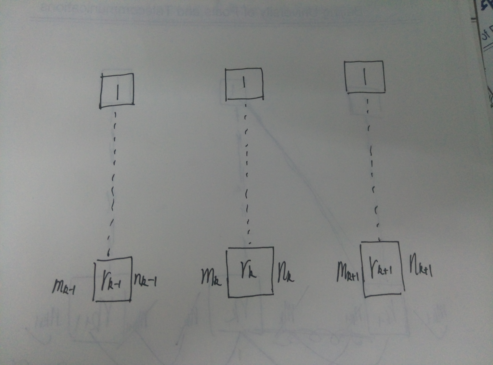
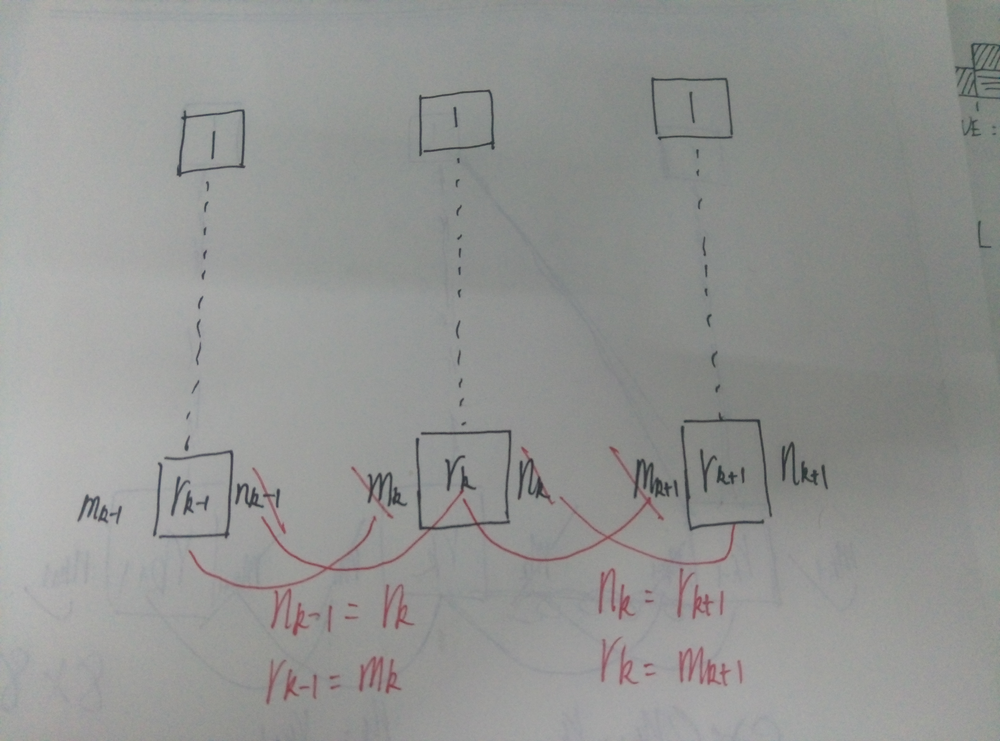

### 开关阵列（空分交换）
开关阵列非常简单，上课只讲了无向的。M条入线，N条出线，则有M*N个开关。一般把入线i与出线j交叉点的开关记为$K_{ij}$。
没有任何存储器。

### 空间(S)接线器（空分交换）
实现一个时隙内任意母线间的交换。
**有一个控制存储器CM**。
分输入控制和输出控制方式。

如果控制存储器按照输入复用线配置，即控制每条输入复用线上应该打开的开关，把这种控制方式叫做输入控制方式；如果控制存储器按照输出复用线配置，即控制每条输出复用线上应该打开的交叉点开关，则把这种控制方式叫做输出控制方式。

####输入控制方式
在输入控制方式下，控制存储器的数量取决于输入复用线数，控制存储器所含有的单元数等于输入复用线所复用的时隙数，每个存储器单元的内容表示输入复用线与所有输出复用线的交叉点开关哪一个在该单元所对应的时隙内接通。

####输出控制方式
不再赘述

其中输出控制方式可以实现同发和广播，且可以自动避免出线冲突。

###共享存储器型时分交换单元

###CLOS网络
CLOS网络中，怎么记参数之间的相等关系？
首先在纸上画出k-1，k，k+1三级，标上参数

①考察k-1级的1号交换单元，该交换单元的每一条出线依次连接到第k级的每一个交换单元的第一条入线上，所以有$n_{k-1}=r_k$
②再考察k-1级的$r_k$号交换单元，该交换单元的每一条出线依次连接到第k级的每一个交换单元的最后一条入线上，那么有$r_{k-1}=m_k$
然后调整k的取值，可以得到
$n_{k-1}=r_k,n_k=r{k+1}$
$r_{k-1}=m_k,r_k=m_{k+1}$
从图上看更加清晰，我们划掉多余的等值参数，在这三级上，最终有用的参数只有$(m_{k-1},n_{k+1},r_{k-1},r_k,r_{k+1})$

取k=2，得到参数元组为$(m_1,n_3,r_1,r_2,r_3)$，这就是我们通常所说的三级CLOS网络
根据$m_1$和$n_3$是否相等，$r_1$和$r_3$是否相等，可以分为对称CLOS网络和非对称CLOS网络

假设最终需要构造M*N的交换网络,最小交换单元为t*t
第一级的交换单元个数:$r_1=\frac{M}{t}$
第一级的交换单元容量:$t*t,m_1=t$
第三级的交换单元个数:$r_3=\frac{N}{t}$
第三级的交换单元容量:$t*t,n_3=t$
第二级的交换单元个数:
严格无阻塞:$r_2>=m_1+n_3-1$
可重排无阻塞:$r_2>=max(m_1,n_3)$
第二级的交换单元容量$r1*r3$
####严格无阻塞条件
$r_2>=m_1+n_3-1$
这个条件非常好理解，看一下PPT上的举例说明即可

####可重排无阻塞条件
$r_2>=max(m_1,n_3)$
这个PPT上的举例说明就感觉有点牵强了，先记住吧

####例题1
构造8\*8的可重排无阻塞CLOS网络（用2\*2的交换单元组成）
$m_1=n_3=2$，可重排无阻塞的条件为$r_2>=2$
由于是8\*8的，且最小交换单元为2\*2，所以第一级和第三级分别需要四个交换单元。所以$m_1=2,n_3=2,r_1=4,r_3=4,r_2=2$
即参数为(2,2,4,2,4)
显然，第一级和第三级的都是2\*2交换单元，但是第二级的是两个4\*4的交换单元
我们没有4\*4的交换单元，因此需要递归构造
在这个4\*4的交换单元中，第一级和第三级均有2个2\*2的交换单元，所以第二级也需要2个2\*2的交换单元。

在上述过程中，$r_2$均取所给条件下能取的最小值，这样构造出来的网络又叫Benes网络，N\*NBenes网络是对称的，其第一级和最后一级均是N/2个2\*2的基本交换单元，中间是2个N/2\*N/2的子Benes网络。

Benes网络可以像上述的这样递归的构造，也可以由两个N\*N的Banyan网络对称叠加而成（最中间的一级重叠）

我们知道Banyan网络是单通路网络，将两个Banyan网络叠加形成的Benes网络就是多通路网络了。Benes网络具有可重排无阻塞的特点。

####例题2
例题1的数字不够典型，下面再以课本P65的习题14进行讲解。
若入口级选择8入线的交换单元，出口级选择8出线的交换单元，试构造128\*128的三级严格无阻塞CLOS网络。
$m_1=n_3=8$
$r_1=128/8=16$
$r_3=128/8=16$
$r_2>=8+8-1=15,r_2=15$
因此参数为(m_1=8,n_3=8,r_1=16,r_2=15,r_3=16)
因此第一级有$r_1=16$个$m_1*r_2=8*15$的交换单元
第二级有$r_2=15$个$r_1*r_3=16*16$的交换单元
第三级有$r_3=16$个$r_2*n_3=15*8$的交换单元

###TST网络
感觉TST网络是最难的、最复杂的。
首先看一下PPT 97页的图或者课本 51页的图，强行理解一下。
T、S、T的控制方式有多种不同的组合。
一般情况，为了方便交换的控制，TST网络的两级T接线器通常采用不同的工作方式。例如第1级T接线器采用输出控制方式，第3级T接线器采用输入控制方式；也可以是第1级T接线器采用输入控制方式，第3级T接线器采用输出控制方式；对于中间级S接线器，采用何种控制方式均可。
对于每一种控制方式的组合，我们需要检验是否支持同发。
内部时隙的选择一般采用“反相法”，即两个方向的内部时隙相差半个帧。一般地，设TST交换网络输入线或输出线的帧的时隙数为F，选定的A→B方向上的内部时隙为$TS_{A→B}$，则B→A方向上的内部时隙为$TS_{B→A}=TS_{A→B}+F/2$
老师上课解释了一下为什么采用这样的选择内部时隙的方法，主要是以前要考虑存储容量限制什么的，我也没听懂，反正到现在这么选择只是习惯问题了。
在一般情况下，TST网络存在内部阻塞，但概率非常小，约为$10^{-6}$

